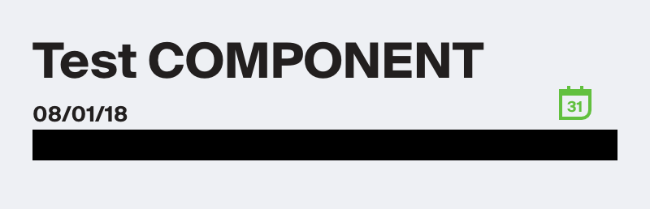

# Protractor Screenshot Extension
A simple, light-weight extension for Protractor (Angular's integration testing tool) that allows you to test visual screenshots of your application or individual elements. This extension uses the `pixelmatch` npm module under the hood for image comparison. Furthermore, it is very easy to indicate sections of the screenshot to ignore during the image comparison that may be susceptible to change. You can do this by specifying an array of rectangular areas to ignore or an array of elements using Protractor's ElementFinder api.

## Installation
```shell
npm install protractor-screenshot-extension --save-dev
```

## Usage and Interfaces
In order to add this extension to your Protractor browser instance, you can add the following few lines to your `protractor.conf.js` file.
```js
const { ProtractorScreenshotExtension } = require('protractor-screenshot-extension');

exports.config = {
   // your config here ...

    onPrepare: function() {
        browser.screenshotExtension = new ProtractorScreenshotExtension('path/to/save/screenshots');
    },
}
```
ProtractorScreenshotExtension should be initialized with a path to where you want your screenshots to be saved. Inside that directory, 3 subdirectories will be created - `/baseline`, `/actual` and `/diff`. Commit the `/baseline` images to your repo. `/actual` and `/diff` are only created on a failure - I recommend adding these paths to your `.gitignore` file.

There are only 2 functions exposed for use during your e2e tests:
* `checkElementScreenshot(element: ElementFinder, tag: string, options: IScreenshotOptions)`
    * element - the element to take a screenshot of
    * tag - the name of the baseline image to check
    * options - [see options](#options-iscreenshotoptions) below
* `checkPageScreenshot(tag: string, options: IScreenshotOptions)`
    * tag - the name of the baseline image to check
    * options - [see options](#options-iscreenshotoptions) below

```ts
interface IRectangle {
    x: number;
    y: number;
    w: number;
    h: number;
}

interface IScreenshotOptions {
    ignoreRectangles?: IRectangle[];
    ignoreElements?: ElementFinder[];
    threshold?: number;
    includeAA?: boolean;
}
```

## Simple Example
Below is a simple example of testing a basic element screenshot:
```ts
    it('should compare screenshots of the test-angular-component', async () => {
        const diffPixels = await browser.screenshotExtension.checkElementScreenshot(
            element(by.css('test-angular-component')),
            'test-angular-component'
        );
        expect(diffPixels).toEqual(0);
    });
```

The first time you run your test suite, all screenshots will be saved in the `/baseline` folder. All subsequent executions will compare the live screenshot to this baseline.

## Options (IScreenshotOptions)
There are several options available for tuning your test to make it more robust to changes
* `ignoreRectangles?: IgnoreRectangle[]` - an array of objects that describe a rectangle to be ignored during the image comparison. These rectangles will appear blacked out in the baseline image that gets saved, so it is easily verifiable to the human eye.
* `ignoreElements?: ElementFinder[]` - an array of elements that should be ignored during the image comparison. These elements will appear blacked out in the baseline image that gets saved, so it is easily verifiable to the human eye.
* `threshold?: number` - Matching threshold, ranges from 0 to 1. Smaller values make the comparison more sensitive. 0.1 by default. For more information [see the pixelmatch docs](https://github.com/mapbox/pixelmatch).
* `includeAA?: boolean` - If true, disables detecting and ignoring anti-aliased pixels. false by default. For more information [see the pixelmatch docs](https://github.com/mapbox/pixelmatch).

## Example using the ignore options
```ts
    it('should compare screenshots of the test-angular-component', async () => {
        const diffPixels = await browser.screenshotExtension.checkElementScreenshot(
            element(by.css('test-angular-component')),
            'test-angular-component',
            {
                ignoreElements: [ element(by.css('test-angular-component .subsection-to-ignore')) ]
            },
            {
                ignoreRectangles: [ { x: 100, y: 100, w: 200, h: 15 } ]
            }
        );
        expect(diffPixels).toEqual(0);
    });
```

### Example output
This is an example of what image files get created. In this example only one `ignoreElement` was passed.

| expected | actual | diff |
| --- | --- | --- |
|  |  |  |

## Contribution
Be sure to first build the module and then execute `npm run e2e` at the toplevel of the repository if making any local modifications to run the test suite.

See [CONTRIBUTING.md](./CONTRIBUTING.md).